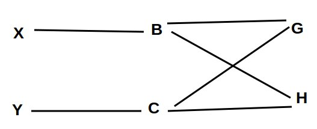
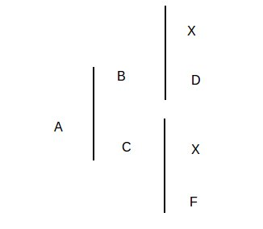

<!-- Limit image width and height -->

<!-- Center image on slide -->

## Fatores que alteram a frequência gênica

1. Seleção
2. Mutação
3. Migração

---

## Seleção

- Consiste na escolha de determinados indivíduos de determinada população para reprodução. Visa aumentar as taxas dos genes destes indivíduos nas gerações seguintes do rebanho.

- Verificar o efeito calculando a frequência alélica.

---

## Seleção - Exemplo

- Uma população de **30** indivíduos marrons (**A1A1**); **30** indivíduos pretos (**A2A2**); **40** indivíduos castanhos (**A1A2**).

Considerando somente a seleção dos indivíduos A1A1 para seleção isso fez com que aumentasse para 60 animais marrons na população:

60 A1A1 + 40 A1A2 + 30 A2A2

----
## Seleção - Exemplo

- Alelo A1 = 160
- Alelo A2 = 100

- Total de Alelos = 260

- f(A1) = 0.61
- f(A2) = 0.39

- A frequência do Alelo A1 era de 0.5 e passa a ser 0.63.

----

## Mutação

- É a mudança ao acaso no material genético do animal. Considerado efeito permanente pode ser transmitido para a prole.
- Taxas de mutações naturais são baixas, ocorrência de mutação em muitos animais indica a presença de condição predisponente.

---

## Migração

- Consiste no deslocamento do indivíduo ou grupo de indivíduos de uma população para outra.
- A frequência gênica pode ser mudada na proporção de indivíduos migrados.

---

## Migração - Exemplo

- Uma população de **30** indivíduos marrons (**A1A1**); **30** indivíduos pretos (**A2A2**); **40** indivíduos castanhos (**A1A2**).

- Se ocorrer uma migração de **60** indivíduos pretos qual a frequência dos alelos?

30 A1A1 + 40 A1A2 + 90 A2A2

---

## Migração - Exemplo

- Alelo A1 = 100
- Alelo A2 = 220

- Total de Alelos = 320

- f(A1) = 0.31
- f(A2) = 0.68

- A frequência do Alelo A2 era de 0.5 e passa a ser 0.68.

---

## Parentesco

- Indivíduos são considerados parentes quando possuirem em sua genealogia ao menos um acestral comum (genes em comum).

- Ao cruzar um casal (A x B) e deles nascer dois indivíduos X e Y) ambos carregarão metade dos genes de cada pai. 

- $R_{xy}$ (grau de parentesco entre X e Y) pode ser representado como?

---

## Parentesco

---

## Parentesco

- Coeficiente de parentesco pode ser calculado como:

- R$_x$$_y$ = $\sum$$(1/2)^{n+n'}$

1. $R_{xy}$ é o grau de parentesco;
2. $n$ é o número de gerações entre o ascendente comum e o animal X;
3. $n'$ é o número de gerações entre o ascendente comum e o animal Y.

---

## Parentesco

- $R_{xy}$ = $1/2 * 1/2 + 1/2 * 1/2$ 

- $1/4 + 1/4$ = $2/4$ = $0.5$ = 50%

---

## Pedegree

- Trata-se do conjunto de informações da ascendência de um indivíduo.
- Arquivos genealógicos, no Brasil a raça Holandesa é a que possui maior registro genealógico.

---

## Pedegree

- *Pedegrees* dos indivíduos X e Y

---

## Pedegree

- Parentesco dos indivíduos X e Y

---

## Pedegree

- Ancestrais comuns de X e Y

- O número de gerações é 4;
- ${1/4}^4$ = 0.0625

- $R_{xy}$ = 0.0665 + 0.0625 = 0.125 = 12.5% = $R_{xy}$

---

## Endogamia ou Consanguinidade

- Endogamia consiste no acasalamento de indivíduos parentes ou consanguineos. 
- Quando os pais de uma animal possuem um ou mais acnetrais comuns, dizemos que ele é consanguíneo.

- Problema?  Aumento da chance da ocorrência de genes recessivos homozigotos.
- Ao longo das gerações ocorre o aumento da frequencia de animais homozigos com consequente redução dos heterozigotos.

---

## Coeficiente de Consanguínidade (F)

- A probabilidade de que os genes nos gametas sejam identicos por decendência.
- Os valores variam de 0 a 1.
- O maior grau de consanguinidade ocorre no acasalamento de pai com filha.
- O valor de F é determinado como metade do parentesco existente entre os pais.
- R$_x$$_y$ = $(1/2)^{n}$

---

## Coeficiente de Consanguínidade - Exemplo

- B - X - C = 2

---

## Coeficiente de Consanguínidade - Exemplo

- Determinação do parentesco
- $R_{BC}$= ${1/2}^2$ = $1/4$ = 0.25 

## Coeficiente de Consanguínidade - Exemplo

- Determinação do coeficiente de consanguínidade
- $F_{X}$= $R_{BC}$/2 = 0.125

---

## Consanguinidade

- O cruzamento de indivíduos aparentados favorece o aumento de **Homozigostos**, ou seja, tanto dominantes quanto recessivos.
- Os efeitos de cruzamentos consanguíneos podem ser tanto positivos quanto negativos.

- Desvantage: queda no valor adaptativo da espécie que pode levar a espécie a extinção. Queda de fertilidade e aparecimento de malformação.

---

## Consanguinidade

- Como contornar o efeito da consanguinidade no rebanho?

- Introdução de reprodutor que não seja aparentado.

---

## Utilização da endogamia

1. Aumento da prepotência
2. Formação de linhagens endogâmicas
3. Deleção de genes recessivos
4. Seleção para tipo

---

## Prepotência

- Consiste na capacidade de um animal imprimir na prole suas características independente do animal do qual ele(s) foi acasalado.
- Ocorre quando existe maior frequência de genes homozigotos dominantes.

---

## Formação de linhagens endogâmicas

- Utilizando de uma população heterogênea, cruzamentos consanguíneos entre alguns indivíduos produzem subpopulações da população que as deu origem. A tendência é a formação de duas populações fenotipicamente distintas.
- Utilizada para aproveitar heterose e vigor híbrido.

---

## Detecção de genes recessivos

- O cruzamento faz determinar se existiam genes recessivos anômalos na população. Até então os genes poderiam não ter expressado uma característica fenotípica por estar na presença de gene dominante.

---

## Seleção para tipo

- Cruzamento para direcionar a obtenção de indivíduos com certa conformação para obtenção de características vantajosas. Pode ser utilizado para tentar minimizar problemas de conformação.

---

# FIM

